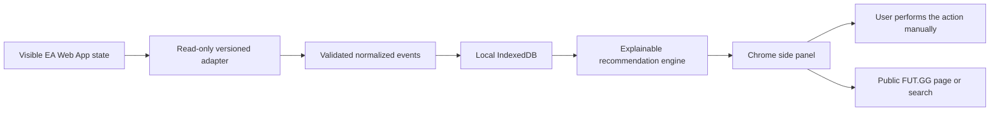

# FUT Copilot

FUT Copilot is a local-first Chrome extension for a personalized EA SPORTS FC Ultimate Team workflow. It is designed to reduce the repetitive work around SBC grinding, duplicate items, and manual transfer decisions while keeping the player in control of every in-game action.

> [!IMPORTANT]
> This is an independent personal project. It is not affiliated with, endorsed by, or sponsored by Electronic Arts or FUT.GG.

## Project status

The 0.1.0 MVP preview provides:

- A Chrome Manifest V3 side-panel extension built with WXT, React, and TypeScript.
- Runtime-validated models for cards, ownership, preferences, duplicates, SBCs, market observations, recommendations, and adapter events.
- A versioned local IndexedDB database with schema migration plus validated JSON backup and restore.
- A deterministic fixture harness for developing EA Web App observation without depending on a live account.
- A versioned FC 26 adapter that recognizes the English My Club Players and Active Squad screens, extracting a selected card or the ordered 11/7/5 squad groups.
- A typed content-script/background/side-panel message flow with explicit loading, empty, ready, unsupported, and degraded states.
- Persistent personal tags, notes, protection rules, and identity-safe local card context.
- A public FUT.GG exact-or-search link that opens only after a user click.
- Explainable keep, sell, and SBC recommendations driven by editable favorite-player, favorite-club, Evolution, meta, market, and SBC weights, with protection overrides.
- Full local duplicate destination/resolution logging, rating-only SBC planning with visible-card protection scans, a manual market calculator, transaction journal, selling guard, settings, and compatibility workspaces.
- Automated permission, fixture-redaction, formatting, lint, type, test, and production-build checks.
- A GitHub Actions gate that runs the same `pnpm verify` pipeline on pull requests and project branches.

The selected-card Club and Active Squad slices have been validated against the live English FC 26 Web App. Pack, pick, duplicate, SBC, and market context contracts have deterministic synthetic coverage; their live page adapters are still release gates and are reported as unsupported instead of guessed. See [`docs/release/known-limitations.md`](docs/release/known-limitations.md).

## Goals

FUT Copilot is being built around one player's most-used workflows:

1. Triage duplicate items after packs and player picks.
2. Identify sensible SBC inputs without sacrificing protected cards, favorites, active-squad players, or Evolution projects.
3. Record PlayStation market observations and support calmer buy/sell decisions.
4. Reach the appropriate FUT.GG research page quickly.
5. Explain why a recommendation was made and which facts remain uncertain.

## Non-goals and safety boundary

FUT Copilot is an informational copilot, not an automation bot.

- No automatic buying, bidding, listing, SBC submission, pack opening, player-pick selection, discarding, quick-selling, or item recovery.
- No password, passkey, cookie, access-token, refresh-token, authorization-header, or authenticated-response collection.
- No raw EA page HTML in fixtures, storage, or backups.
- No FUT.GG private API use, scraping bypass, rate-limit bypass, or undocumented endpoint dependency.
- No cloud account is required; data remains in the browser unless the user explicitly exports it.

The user remains responsible for every action performed in the EA Web App and for following the applicable service rules.

## How it works



EA-specific selectors are isolated in the adapter package. Storage, UI, and recommendation code consume normalized events and never receive DOM nodes or raw HTML. Unknown and ambiguous observations remain explicit rather than being silently guessed.

## FUT.GG integration approach

The MVP treats FUT.GG as a user-facing research destination:

- Open an exact public player page when card identity is sufficiently strong.
- Fall back to a FUT.GG player search when identity is ambiguous.
- Let the user record relevant PlayStation prices with source and timestamp.
- Continue working locally if FUT.GG is unavailable.

Automatic FUT.GG data access would require a documented API and explicit authorization. It is not assumed by this project.

## Requirements

- Node.js 22 or newer
- pnpm 11
- Chrome 114 or newer

## Install and verify

```bash
pnpm install
pnpm verify
```

`pnpm verify` runs:

- Prettier formatting checks
- ESLint
- TypeScript checks for every workspace
- Vitest tests
- Synthetic-fixture redaction checks
- Chrome production build
- Generated-manifest permission checks

## Run the extension

For development with WXT hot reload:

```bash
pnpm dev
```

To load a verified production build:

```bash
pnpm build
```

Then:

1. Open `chrome://extensions`.
2. Enable **Developer mode**.
3. Select **Load unpacked**.
4. Choose `apps/chrome-extension/.output/chrome-mv3/`.
5. Click the FUT Copilot toolbar action to open the side panel.

The extension currently requests only `storage` and `sidePanel`. Its content script is restricted to:

```text
https://www.ea.com/ea-sports-fc/ultimate-team/web-app/*
```

It declares no general host permission and no FUT.GG host permission.

## Repository layout

```text
apps/
  chrome-extension/       WXT runtime and React side panel
packages/
  domain/                 Zod entities and normalized event contracts
  ea-web-adapter/         Read-only EA adapter and fixture harness
  recommendation-engine/ Explainable card, SBC, and market logic
  storage/                Dexie schema, repositories, backup, and import
fixtures/
  ea-web/                  Synthetic and redacted screen scenarios
docs/
  adr/                     Architectural decisions
  architecture/            System boundaries and data flow
  backlog/                 Current executable milestone
  compatibility/           EA Web App compatibility evidence
  policy/                  Data-source and account-safety rules
  product/                 MVP scope and success measures
  release/                 Installation, rollback, privacy, and smoke tests
outputs/                   Research, personalized specification, and full plan
scripts/                   Permission and fixture-safety validators
```

## Local data model

Database version 2 contains twelve tables:

- Profiles
- Card definitions
- Owned cards
- Normalized observations
- Personal tags
- Protection rules
- Duplicate cases
- SBC definitions
- SBC proposals
- Market observations
- Market transactions
- Adapter compatibility records

Backup import is validated before any write. Replacement imports can create a backup of the existing database first; merge conflicts use the imported record for the matching primary key.

## Development principles

- Validate all external and persistence boundaries.
- Require explicit `tradeable`, `untradeable`, or `unknown` state.
- Keep `known`, `inferred`, `unknown`, and `stale` observations distinct.
- Never collapse ambiguous card identities silently.
- Keep EA page-shape knowledge inside the adapter package.
- Add a synthetic or aggressively redacted fixture for every new page assumption.
- Make every recommendation explainable and every game-changing action manual.

See [`AGENTS.md`](AGENTS.md) for implementation rules, [`docs/backlog/current-milestone.md`](docs/backlog/current-milestone.md) for the active release gate, and [`docs/release/README.md`](docs/release/README.md) for installation, backup, rollback, privacy, and test instructions.

The latest reproducible automated and owner-assisted evidence is recorded in
[`docs/release/verification-2026-08-01.md`](docs/release/verification-2026-08-01.md).

## Roadmap

- [x] Repository, extension, domain, storage, backup, and fixture foundation
- [x] User-assisted visible-UI observation spike
- [x] Club screen classifier and adapter health state
- [x] Selected-card observation in the side panel
- [x] Protection, favorites, tags, and notes
- [x] FUT.GG exact-page/search deep links
- [x] Duplicate triage workflow and synthetic event contract
- [x] Rating-oriented SBC proposal workflow and synthetic event contract
- [x] Manual market journal and calculator
- [x] Local-first recommendation engine
- [ ] Live active-squad, pack, pick, duplicate, SBC, and market extractors
- [ ] Full manual regression matrix on a supported EA Web App build
- [ ] iPhone companion exploration after the Chrome MVP

The exhaustive task breakdown is in [`outputs/fut-copilot-mvp-implementation-plan.md`](outputs/fut-copilot-mvp-implementation-plan.md).

## Contributing

This is currently a personal learning project, but focused issues and suggestions are welcome. Please preserve the safety boundary, avoid committing live account data, and run `pnpm verify` before proposing a change.

## License

No open-source license has been selected yet. Public visibility does not grant permission to copy, modify, or redistribute the code.
