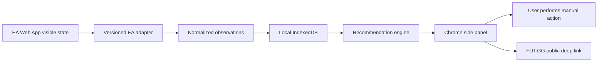

# System architecture

## Package boundaries

- `apps/chrome-extension` owns the WXT runtime, side panel, and browser wiring.
- `packages/domain` owns runtime-validated entities, events, and compatibility metadata.
- `packages/storage` owns schema migrations, workspace repositories, and backup/import. UI code does not query Dexie tables directly.
- `packages/ea-web-adapter` is the only code allowed to know EA DOM or route details.
- `packages/recommendation-engine` consumes normalized data and produces explainable card, SBC, and market suggestions.

## Event rule

Adapters emit small normalized observations. They never expose DOM nodes or raw HTML to storage or UI. Unsupported or ambiguous states are valid results and must not be coerced into a match.

## Local-first rule

IndexedDB is the source of truth for the MVP. Exports are explicit, portable JSON backups. Cloud and mobile synchronization remain outside the MVP.
