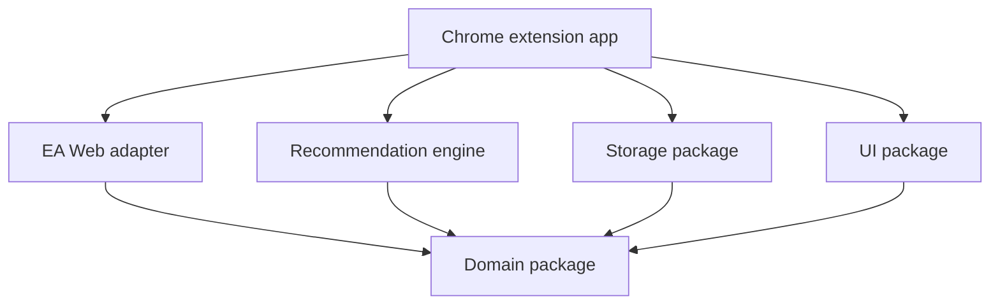
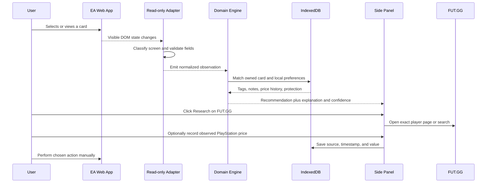
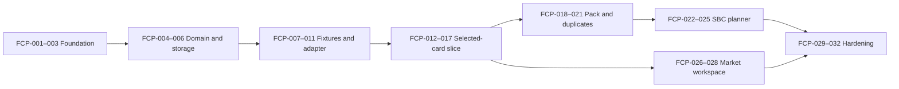

# FUT Co-Pilot MVP Implementation Plan

Status: FCP-001 through FCP-007 implemented; FCP-008 next
Updated: August 1, 2026
Target: EA SPORTS FC 26 Web App on desktop Chrome, PlayStation market profile
Implementation style: local-first, assistive, testable, and AI-agent-friendly

## Implementation status — August 1, 2026

- FCP-001 through FCP-007 are implemented and verified in the workspace.
- The production Chrome MV3 build is generated at `apps/chrome-extension/.output/chrome-mv3/`.
- The automated gate currently covers formatting, linting, TypeScript, 16 tests, eight synthetic fixture categories, production build, and the generated permission manifest.
- The next task is FCP-008: a user-assisted, visible-UI-only EA Web App observation session. No raw HTML, HAR file, cookie, token, or authenticated response capture is permitted.

## 1. MVP outcome

The MVP is complete when the user can open the official EA Web App and use FUT Co-Pilot to:

1. Recognize a selected visible player card.
2. Capture the visible active squad, pack result, player pick, duplicate, SBC, or market context.
3. Add persistent personal tags and protection rules.
4. Open the best available FUT.GG research page without scraping FUT.GG.
5. Record a manual PlayStation price and calculate configurable net-sale and break-even values.
6. Receive an explained keep, sell, or SBC recommendation.
7. Place detected duplicates into a local triage queue.
8. Warn when a protected, favorite, active-squad, or Evo card is at risk.
9. Generate a reviewable rating-only SBC proposal from locally known cards.
10. Export and restore the local Co-Pilot database.

All buying, bidding, listing, quick-selling, pack opening, player-pick selection, squad placement, and SBC submission remain manual EA Web App actions.

## 2. Exact MVP scope

### Included

- Chrome Manifest V3 extension
- WXT, React, and TypeScript extension application
- Persistent Chrome side panel
- Minimal Shadow-DOM badges and warnings on the EA page
- Read-only, versioned EA Web App adapter
- Screen classification
- Selected visible card recognition
- Visible active-squad capture
- Visible pack-result and player-pick capture
- Visible duplicate detection
- Visible SBC requirement capture for supported rating-only cases
- Visible market context capture
- Local card identity resolution and ambiguity handling
- Personal tags, notes, and protection rules
- Explainable keep, sell, and SBC recommendation models
- Duplicate triage queue
- Rating-only SBC planner
- Manual PlayStation market observations and transaction journal
- FUT.GG player/search deep links
- Local IndexedDB persistence through Dexie
- JSON backup export/import with schema versioning
- Sanitized adapter fixtures and fixture-driven tests
- Adapter health indicator and fail-closed behavior
- Unpacked local installation instructions

### Explicitly excluded

- Automatic full-club download
- EA Community API access
- FUT.GG private endpoints or scraping
- Automatic FUT.GG prices or GG Rating ingestion
- Advanced Evolution analysis
- Chemistry-aware SBC solver
- Full multi-segment or repeatable SBC automation
- Any automatic EA transaction or submission
- CAPTCHA, rate-limit, or soft-ban avoidance
- Cloud account and multi-device synchronization
- iPhone or Safari extension
- Chrome Web Store publication

These exclusions are product boundaries, not forgotten tasks.

## 3. Technical decisions

### Extension framework

Use **WXT + React + TypeScript**.

Reasons:

- Manifest V3 support
- File-based extension entrypoints
- Strong TypeScript development model
- Development reload and UI iteration support
- A future path to Safari without forcing Safari into the MVP

WXT documents Chrome, Firefox, Edge, and Safari builds from one codebase. [WXT documentation](https://wxt.dev/)

### Persistence

Use **Dexie over IndexedDB**.

Reasons:

- Local-first storage
- Typed tables and transactions
- Explicit schema migrations
- Reactive React queries
- No server required

Dexie 4 provides built-in TypeScript types and versioned IndexedDB schemas. [Dexie TypeScript guide](https://dexie.org/docs/Typescript)

### State and validation

- Zod schemas for every adapter, import, and persistence boundary
- Domain state through small service objects and React hooks
- No global application state framework in the first scaffold
- Add one only if cross-workspace state becomes demonstrably difficult

### Testing

- Vitest for domain and storage tests
- React Testing Library for side-panel components
- Playwright for built extension smoke tests against local fixture pages
- Custom fixture harness that simulates EA screen transitions and mutations
- No normal automated test runs against the live EA account

### Styling

- CSS Modules or locally scoped CSS
- Shadow DOM for anything mounted into the EA page
- No dependency on EA CSS classes for appearance
- Accessible color tokens and keyboard focus states

## 4. Repository structure

```text
fut-copilot/
  AGENTS.md
  README.md
  CHANGELOG.md
  package.json
  pnpm-lock.yaml
  pnpm-workspace.yaml
  tsconfig.base.json
  eslint.config.js
  apps/
    chrome-extension/
      entrypoints/
        background.ts
        content.ts
        sidepanel/
      public/
      wxt.config.ts
  packages/
    domain/
      src/entities/
      src/events/
      src/identity/
    ea-web-adapter/
      src/contracts/
      src/detectors/
      src/extractors/
      src/health/
    recommendation-engine/
      src/keep/
      src/sell/
      src/sbc/
      src/explanations/
    storage/
      src/schema/
      src/repositories/
      src/export/
    ui/
      src/components/
      src/tokens/
  docs/
    README.md
    product/
    architecture/
    policy/
    adr/
    backlog/
    compatibility/
  fixtures/
    README.md
    ea-web/
      selected-card/
      active-squad/
      pack-result/
      player-pick/
      duplicate/
      sbc/
      market/
      unsupported/
  scripts/
    verify-permissions.ts
    verify-fixture-redaction.ts
  tests/
    extension-smoke/
```

## 5. Package dependency rules



Rules:

- `domain` imports no other workspace package and no DOM or Chrome API.
- `ea-web-adapter` can read DOM state but cannot write or trigger EA game actions.
- `recommendation-engine` accepts normalized domain data only.
- `storage` is the only package that knows Dexie.
- `ui` displays supplied view models and does not compute recommendations.
- The extension application composes packages and owns Chrome messaging.
- No EA selector is permitted outside `ea-web-adapter`.

## 6. Runtime data flow



## 7. Core domain model

### Observation

```ts
type ObservationStatus = "known" | "inferred" | "unknown" | "stale";

interface Observation<T> {
  value: T | null;
  source: "ea-visible-ui" | "user" | "local-history" | "authorized-public-data";
  observedAt: string;
  status: ObservationStatus;
  evidence?: string[];
}
```

### Card definition

Represents a generic UT card version:

- FC year
- EA asset/player ID when safely available
- Exact resource/card ID when safely available
- Name
- Overall rating
- Position
- Club, league, and nation
- Rarity/promotion
- Card image reference only when permitted
- Identity confidence

### Owned card

Represents the user’s specific copy:

- Local UUID
- Card-definition identity
- Ownership status
- Tradeability: `tradeable | untradeable | unknown`
- First-owner state when known
- Location: active squad, bench, reserves, club, SBC storage, duplicate queue, transfer list, unassigned, or unknown
- Purchase price when entered
- Protection and personal tags
- Notes
- First and last observation timestamps

### Other entities

- `PersonalProfile`
- `ProtectionRule`
- `CardIdentityCandidate`
- `DuplicateCase`
- `DuplicateResolution`
- `SbcDefinition`
- `SbcRequirement`
- `SbcProposal`
- `Recommendation`
- `RecommendationReason`
- `MarketObservation`
- `MarketTransaction`
- `AdapterHealth`
- `CompatibilityRecord`

## 8. Adapter event contract

The adapter emits:

- `screen.changed`
- `card.selected`
- `cards.visible`
- `activeSquad.visible`
- `packResult.visible`
- `playerPick.visible`
- `duplicate.detected`
- `sbcContext.visible`
- `marketContext.visible`
- `adapter.degraded`
- `adapter.recovered`

Every event must contain:

- Event version
- Web App build identifier when available
- Timestamp
- Normalized observations
- Confidence/status
- No raw HTML, cookies, headers, or credentials

Repeated DOM mutations must be debounced and duplicate events deduplicated.

## 9. MVP user interface

### Side-panel navigation

1. **Context** — selected player, tags, protection, recommendation, FUT.GG link
2. **Duplicates** — unresolved triage queue
3. **SBC** — visible target, protected-card scan, rating proposal
4. **Market** — price observation, calculator, targets, journal
5. **Settings** — profile, weights, favorite rules, backup, adapter status

### On-page UI

Keep page injection minimal:

- Small protection/favorite/Evo badges
- High-visibility protected-item warning near risky contexts
- Button or keyboard command to open the side panel
- Adapter-degraded warning when visible state is unsupported

Do not rebuild the EA interface or cover primary controls.

## 10. Ordered implementation backlog

The IDs below are the canonical execution order. An AI agent should work on the first unblocked incomplete item unless assigned a narrower task.

### Foundation

#### FCP-001 — Scaffold the monorepo

Deliver:

- pnpm workspace
- WXT React extension
- Shared TypeScript, ESLint, and Vitest configuration
- Root scripts: `dev`, `build`, `lint`, `typecheck`, `test`, `test:fixtures`, `verify`

Acceptance:

- `pnpm verify` passes from a fresh checkout.
- Unpacked extension loads and opens an empty side panel.

#### FCP-002 — Add agent and project documentation

Deliver:

- Root `AGENTS.md`
- Documentation map
- Product scope and non-goals
- Safety boundary
- Current milestone and task-status files
- Initial ADRs for local-first storage, manual actions, and adapter isolation

Acceptance:

- A new agent can identify commands, constraints, and the next task using repository files only.

#### FCP-003 — Lock the manifest permission baseline

Initial permissions:

- `storage`
- `sidePanel`

Initial manifest features:

- `commands` as a top-level manifest entry for an optional user gesture; it is not a permission string.
- Content-script match limited to the official EA Ultimate Team Web App path

Acceptance:

- Permission verification script rejects `<all_urls>`, cookies, webRequest, broad FUT.GG access, or an unapproved host.
- The extension makes no remote request during its basic smoke test.

### Domain and storage

#### FCP-004 — Implement domain schemas

Deliver all entities and events from sections 7 and 8 with Zod validation.

Acceptance:

- Unknown, inferred, stale, and known values have separate tests.
- Tradeability cannot default from missing data.

#### FCP-005 — Implement Dexie schema version 1

Tables:

- profiles
- cardDefinitions
- ownedCards
- observations
- personalTags
- protectionRules
- duplicateCases
- sbcDefinitions
- sbcProposals
- marketObservations
- marketTransactions
- compatibilityRecords

Acceptance:

- Repository tests cover create, update, query, transaction rollback, and schema initialization.

#### FCP-006 — Add export/import

Deliver:

- Versioned JSON export
- Validation before import
- Dry-run import summary
- Conflict behavior
- Backup-before-replace option

Acceptance:

- Invalid or newer unsupported schema versions fail without modifying the database.
- Round-trip export/import preserves all supported fields.

### Fixture and adapter foundation

#### FCP-007 — Build the fixture harness

Deliver local simulated pages for all fixture categories.

Acceptance:

- Tests can load a fixture, apply timed mutations, and inspect emitted normalized events.
- Fixture verification rejects obvious account identifiers, emails, tokens, cookies, and authorization data.

#### FCP-008 — Conduct the user-assisted EA UI observation spike

Required screens:

- Active squad with bench/reserves
- Club search/list
- Selected card detail
- Pack result
- Player pick
- Duplicate/unassigned state
- SBC segment and requirement panel
- Transfer Market search results
- Transfer-list item details

Procedure:

1. User signs in to the official EA Web App.
2. Only visible UI structure is observed.
3. Do not record HAR files or authenticated responses.
4. Produce minimal sanitized fixture fragments or hand-authored equivalents.
5. Record stable semantic anchors and unstable selectors.

Acceptance:

- No fixture contains EA credentials, session data, user email, username, club name, coin balance, or other unnecessary personal data.
- Compatibility record identifies the observed FC year and Web App build.

#### FCP-009 — Implement screen classifier and health state

Acceptance:

- Supported fixture screens classify correctly.
- Unsupported/ambiguous screens return `unknown`.
- Degraded adapter state prevents recommendations based on uncertain extraction.

#### FCP-010 — Implement selected-card extractor

Acceptance:

- Emits normalized card identity fields with confidence.
- Handles no selection, concept cards, loans, Evolutions, and incomplete data without crashing.
- No raw DOM escapes the adapter.

#### FCP-011 — Implement visible-card and active-squad extractors

Acceptance:

- Active squad, bench, and reserves remain distinct.
- Repeated observations update timestamps without creating uncontrolled duplicates.
- Ambiguous card identities produce candidate records for confirmation.

### Selected-card vertical slice

#### FCP-012 — Implement side-panel shell and adapter status

Acceptance:

- Side panel receives selected-card events through typed Chrome messages.
- Empty, loading, unsupported, and degraded states are distinct.

#### FCP-013 — Implement tags, protection, and notes

Default tags:

- protected
- favorite
- Evo project
- active squad
- fodder
- investment
- review needed

Acceptance:

- Tag changes persist across restarts.
- Protection overrides numeric recommendations.

#### FCP-014 — Implement card identity resolution

Resolution order:

1. Exact stable ID when safely available
2. Base ID plus card-version facts
3. Composite signature
4. User selection from candidates

Acceptance:

- Ambiguous matches are never silently collapsed.

#### FCP-015 — Implement FUT.GG deep links

Acceptance:

- Exact page is used only when identity is sufficiently strong.
- Otherwise a FUT.GG player search is opened.
- No FUT.GG host permission, scraping, or automatic fetch is introduced.

#### FCP-016 — Implement market calculator

Inputs:

- Observed PlayStation price
- Purchase price
- Configurable tax
- Target buy/list/sale

Outputs:

- Expected net proceeds
- Break-even list price
- Estimated profit/loss
- Observation age and status

Acceptance:

- All calculations have unit tests for rounding and missing data.
- Stale prices are visibly labeled.

#### FCP-017 — Implement recommendation engine v1

Deliver separate keep, sell, and SBC burn models.

Acceptance:

- Each result contains a decision, confidence, and at least two reasons when data permits.
- Protection rules override the score.
- Missing price or tradeability reduces confidence instead of being guessed.

### Pack and duplicate workflow

#### FCP-018 — Implement pack-result and player-pick extractors

Acceptance:

- Visible cards remain in their displayed order.
- Player-pick recommendations never perform selection.
- Unsupported result layouts fail closed.

#### FCP-019 — Implement duplicate detection and case creation

Acceptance:

- Uses EA’s visible duplicate state when present.
- Local identity matches are labeled inferred unless confirmed by EA.
- Duplicate events are idempotent.

#### FCP-020 — Implement duplicate triage queue

Statuses:

- detected
- investigating
- destination selected
- resolved
- dismissed

Acceptance:

- Every resolution stores a user confirmation and timestamp.
- Quick-sell is never the default for an unknown or protected card.

#### FCP-021 — Add on-page protection warnings

Acceptance:

- Warning UI lives in Shadow DOM.
- It does not obscure or programmatically activate EA controls.
- It disappears cleanly when the context changes.

### SBC workflow

#### FCP-022 — Implement SBC context extractor

MVP-supported requirements:

- Number of players
- Minimum team rating
- Simple rarity or minimum-quality count when clearly visible

Acceptance:

- Unsupported chemistry or complex requirements are labeled unsupported, not ignored.

#### FCP-023 — Implement protected-card scan

Acceptance:

- Proposed or visible SBC cards are checked against local protection rules.
- Unresolved identity produces a warning.

#### FCP-024 — Implement rating-only SBC planner

Inputs:

- Locally known eligible owned cards
- Required squad size and rating
- Protection/exclusion rules
- Duplicate and fodder preferences

Strategies:

- Duplicate cleanup
- Club preservation
- Low coin-equivalent cost

Acceptance:

- Every proposal is independently validated before display.
- Protected cards are excluded unless the user explicitly changes the rule.
- Rating calculations and boundary cases have exhaustive tests.
- The planner cannot submit or place the squad in EA.

#### FCP-025 — Implement proposal review UI

Acceptance:

- Shows every selected card, reason, confidence, total rating, overshoot, and warnings.
- Unsupported requirements block a `valid` label.

### Market workflow

#### FCP-026 — Implement manual market observations

Acceptance:

- Stores platform, value, timestamp, source, and card identity.
- PlayStation is the default platform but remains configurable.

#### FCP-027 — Implement transaction journal

Events:

- target created
- purchased
- listed
- sold
- expired
- abandoned

Acceptance:

- Realized and estimated results are separated.
- No transaction is inferred as complete without user confirmation or an unambiguous visible result.

#### FCP-028 — Implement selling guard

Acceptance:

- Warns on protected players and listings below the user’s minimum.
- Performs no listing action.

### Hardening and release

#### FCP-029 — Add adapter compatibility dashboard

Display:

- FC year
- Detected Web App build
- Supported screens
- Last successful observation
- Current adapter health
- Extension version

#### FCP-030 — Complete privacy and permission audit

Acceptance:

- No credentials, cookies, tokens, raw authenticated responses, or raw HTML in storage.
- No remote executable code.
- No broad host permission.
- No analytics or telemetry in the MVP.

#### FCP-031 — Complete full MVP regression matrix

Acceptance:

- All automated checks pass.
- Manual smoke checklist passes on the supported EA build.
- Backup/restore passes using a populated test database.
- A deliberately broken selector causes adapter degradation, not incorrect data.

#### FCP-032 — Produce the unpacked local release

Deliver:

- Production extension build
- Installation guide
- Upgrade and rollback guide
- Data backup instructions
- Known limitations
- Compatibility record

## 11. Dependency path



Parallel work is safe only where package ownership does not overlap. For example, market calculations can proceed alongside fixture development after domain schemas stabilize.

## 12. Test matrix

### Identity states

- Exact stable ID
- Composite signature only
- Multiple candidate matches
- Missing rarity
- Missing club
- Evolved card
- Loan card
- Concept card
- Unsupported special card

### Ownership states

- Tradeable
- Untradeable
- Unknown tradeability
- First owner
- Active squad
- Bench/reserves
- SBC storage
- Transfer list
- Duplicate/unassigned
- Unknown location

### Screen states

- Initial loading
- No selection
- Selected card
- Route transition
- Delayed content
- Repeated DOM mutation
- Modal open/close
- Pack result
- Player pick
- Duplicate warning
- SBC segment
- Transfer search
- Unsupported layout

### Failure states

- Selector removed
- Duplicate events
- Stale local identity
- Corrupt import
- Newer schema import
- IndexedDB quota or transaction failure
- Extension service-worker restart
- FUT.GG link unavailable
- Unsupported Web App build

## 13. Verification commands

The final repository must provide:

```bash
pnpm install
pnpm dev
pnpm lint
pnpm typecheck
pnpm test
pnpm test:fixtures
pnpm build
pnpm verify
```

`pnpm verify` is the authoritative pre-handoff command and must run lint, typecheck, unit tests, fixture tests, build, and permission validation.

## 14. Manual smoke checklist

1. Load the production build as an unpacked extension.
2. Confirm the side panel opens outside the EA site with an inactive message.
3. Open the official EA Web App and sign in normally.
4. Confirm Co-Pilot never asks for EA credentials.
5. Visit a supported active-squad screen.
6. Select a card and confirm normalized details and confidence.
7. Add a protected tag and note; reload and confirm persistence.
8. Open the FUT.GG research link.
9. Record a test PlayStation price and verify calculations.
10. Visit a supported pack or player-pick screen and confirm visible-card detection.
11. Test a duplicate and confirm a single triage case.
12. Visit a supported rating-only SBC and confirm protection scan and proposal validation.
13. Break or disable a fixture selector and confirm fail-closed behavior.
14. Export, clear test data, import, and verify restoration.
15. Inspect extension storage and permissions for prohibited data or access.

## 15. Work estimates

These are planning ranges for an AI-assisted personal project, not deadlines:

| Workstream | Estimated focused effort |
|---|---:|
| Foundation, docs, permissions | 1–2 days |
| Domain and local storage | 2–3 days |
| EA observation spike and fixtures | 2–4 days |
| Selected-card vertical slice | 3–5 days |
| Pack and duplicate workflow | 3–5 days |
| Rating-only SBC planner | 5–8 days |
| Basic market workspace | 2–4 days |
| Hardening and local release | 3–5 days |

The EA adapter is the largest uncertainty. Estimates assume supported visible UI state can be extracted without touching authenticated network traffic or internal services.

## 16. Known implementation gates

### Gate A — Live Web App observation

Repository scaffolding, domain logic, storage, and fixture infrastructure can start immediately. Real adapter implementation requires a user-assisted observation session in the logged-in EA Web App.

### Gate B — Card identity quality

If stable card IDs are not safely available in visible state, composite matching and user confirmation become the MVP identity path. This is acceptable but affects exact FUT.GG deep-link accuracy.

### Gate C — Inventory completeness

The rating-only SBC planner uses locally observed cards. It must show inventory coverage and cannot claim globally optimal club solutions until an authorized full-club import exists.

### Gate D — FUT.GG data access

The MVP requires no FUT.GG API. If official access is granted later, it becomes a separately designed, permissioned integration and does not block the MVP.

## 17. MVP release criteria

Release only when:

- FCP-001 through FCP-032 are complete or explicitly waived in the milestone record.
- `pnpm verify` passes.
- Manual smoke tests pass on the recorded EA build.
- Adapter health fails closed on unsupported state.
- Local export/import is verified.
- Permissions and stored data pass audit.
- No automated game-changing action exists.
- Known limitations clearly state partial club coverage and manual FUT.GG prices.

## 18. First implementation batch

Start with FCP-001 through FCP-007:

1. Scaffold the WXT/React/TypeScript monorepo.
2. Add `AGENTS.md`, policy boundaries, ADRs, and the live milestone file.
3. Lock and test the permission baseline.
4. Implement domain observations, card identity, owned-card, and recommendation schemas.
5. Implement Dexie schema version 1.
6. Implement safe backup export/import.
7. Build the local EA fixture harness.

After this batch, conduct FCP-008 as a user-assisted observation session before writing real EA selectors.
