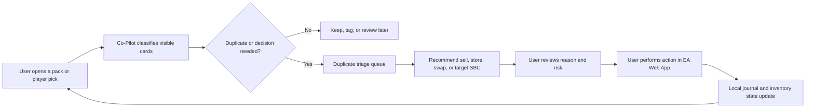

# FUT Co-Pilot: Personalized Product and Implementation Specification

Status: implementation-ready draft
Updated: August 1, 2026
Initial platform: desktop Chrome
Later platform: iPhone

## 1. Product definition

FUT Co-Pilot is a personal, local-first Chrome extension that adds a focused decision and workflow layer to the official EA SPORTS FC Ultimate Team Web App.

It is optimized for three connected activities:

1. Opening packs and evaluating the resulting cards
2. Resolving duplicates and grinding SBCs efficiently
3. Researching, buying, listing, and tracking players manually

The helper will read only the state visible in the current Web App screen, calculate recommendations, preserve personal preferences, and provide warnings. The user remains responsible for all game-changing actions.

## 2. Captured user profile

### Platforms and services

- Primary interface: Chrome desktop
- Later interface: iPhone
- Ultimate Team market: PlayStation
- FUT.GG account: yes
- GG Club connected: yes
- Existing workflow enhancer: FC Enhancer

### Highest-value workflows

1. SBC grinding
2. Duplicate handling after packs and player picks
3. Buying and selling players

### Personal evaluation priorities

The recommendation engine should value:

1. Meta performance and fit
2. Favorite players and clubs
3. Evolution potential and existing Evo projects

Market value remains important for sell and SBC decisions, but it is not the only definition of value.

### Development preference

The repository and documentation must be exhaustive and friendly to AI coding agents. An agent should be able to identify the current goal, boundaries, relevant contracts, test commands, and completion criteria without reconstructing product intent from chat history.

## 3. Assumptions

These assumptions allow implementation to begin without blocking on additional questions:

- All personal data remains on the user’s computer for the Chrome MVP.
- No cloud account or cross-device synchronization is required initially.
- Favorite clubs, players, formations, and preferred roles will be configurable rather than hard-coded.
- FUT.GG is used through user-opened pages and deep links; its site is not scraped.
- GG Club is useful to the user as a research surface, but FUT Co-Pilot will not call or imitate EA’s private Community API.
- Opening packs, submitting SBCs, buying, bidding, listing, and quick-selling remain user actions.
- The extension can provide one-key navigation and calculations, but it will not run unattended loops.

## 4. Core experience

The core experience is one continuous decision loop:



The extension should reduce context switching without pretending to play the menus on the user’s behalf.

## 5. Product workspaces

### 5.1 Pack and Player-Pick Assistant

Purpose: make each pack result immediately understandable.

Required capabilities:

- Detect the currently visible pack result or player-pick screen.
- Identify every visible player when the Web App exposes enough information.
- Apply local status badges:
  - Protected
  - Favorite
  - Active squad
  - Evo project
  - Duplicate
  - Tradeable/untradeable when visible
  - Fodder candidate
  - Review needed
- Rank player-pick choices using the personal scoring model.
- Explain the ranking instead of showing only a number.
- Add a FUT.GG research link for the selected player.
- Create a local review item when card identity or status is uncertain.
- Record the result only after the user confirms what was kept.

Explicit exclusions:

- Automatically opening the next pack
- Automatically choosing a player pick
- Automatically sending, listing, quick-selling, or submitting an item
- Reading unopened-pack contents

Acceptance examples:

- A favorite player is never labeled as ordinary fodder.
- An active Evo project displays a high-visibility protection warning.
- A duplicate can be added to the triage queue in one user action.
- A recommendation contains at least two human-readable reasons.

### 5.2 Duplicate Triage Queue

Purpose: prevent lost cards and shorten the decision between a pack result and the next SBC.

Each queue item should contain:

- Player/card identity and visible rating
- Tradeability if known
- Duplicate state and location if known
- Personal protection state
- Estimated or user-entered market value
- Relevant target SBCs
- Recommended actions with reasons
- Resolution status

Recommended action order is conditional, not universal:

1. Stop and warn if the card is protected, an active Evo project, a favorite, or a high-value item.
2. Prefer keeping the better or more valuable copy when a duplicate swap is possible.
3. Prefer an appropriate target SBC if the duplicate would otherwise block pack opening.
4. Prefer listing a useful tradeable item when the user’s sell rule is satisfied.
5. Use SBC storage when the Web App visibly supports it and the user chooses it.
6. Quick-sell only as an explicit last resort.

The queue must distinguish `unknown` from `false`. For example, if tradeability is not visible, the data model must store `unknown`, not assume untradeable.

### 5.3 SBC Grind Workspace

Purpose: make repeated SBC work faster, safer, and more deliberate.

The workspace should show:

- Current target SBC and segment
- Requirements extracted from the visible screen
- Completion target, such as one completion or a user-defined session goal
- Duplicate queue items that could help
- Protected-player count
- Current proposed squad
- Estimated personal burn cost
- Constraint failures and rating overshoot
- Alternative solution strategies

Solution strategies:

- **Duplicate cleanup:** maximize appropriate duplicate and SBC-storage use.
- **Club preservation:** avoid starters, favorites, Evos, and high replacement-cost cards.
- **Low coin-equivalent cost:** minimize known market and replacement value.

Every solution must expose:

- Why each card was selected
- Which cards were avoided and why
- Whether any fields are uncertain
- Exact requirements satisfied
- Known or estimated opportunity cost

The final SBC exchange remains manual.

Initial solver stages:

1. Rating-only planner with manually selected or locally known cards
2. Rarity, league, nation, club, and card-type constraints
3. Chemistry and position modeling
4. Multiple segments and session-level allocation

Do not begin with a whole-set automated solver. The first goal is a trustworthy proposal engine and protection layer.

### 5.4 Market Workstation

Purpose: make manual buying and selling more informed and less error-prone.

Selected-player panel:

- Personal status and squad fit
- FUT.GG link
- User-observed or user-entered market price
- Target buy, maximum bid, target list, and minimum acceptable sale
- Configurable transfer tax and break-even calculation
- Purchase price and expected net result
- Notes and thesis
- Local price observations over time

Journal events:

- Player researched
- Price observed
- Target set
- Purchased
- Listed
- Relisted by the user
- Sold
- Listing expired
- Abandoned target

Guardrails:

- Warn if the proposed listing is below the configured minimum.
- Warn if a protected player is being considered for sale.
- Show stale-data age beside every price.
- Never describe a FUT.GG price as the exact live market price unless it is current and obtained through an authorized source.
- Never auto-buy, auto-bid, auto-snipe, auto-list, or run market searches unattended.

### 5.5 Focus Mode and Navigation

Purpose: remove irrelevant UI and put common workflows one action away.

Configurable features:

- Hide unused home tiles and panels.
- Compact card lists.
- Persistent extension side panel.
- Shortcuts for opening Co-Pilot workspaces and navigating to frequently used EA sections.
- Saved local filter presets.
- Large warning treatment for protected-card actions.

Shortcuts must follow the rule: one user gesture causes one bounded, visible action.

## 6. Recommendation model

Do not collapse all decisions into one universal rating. Use separate, explainable models.

### 6.1 Keep score

Default configurable components:

- Meta and role fit: 40%
- Favorite player or club affinity: 25%
- Evolution potential or active project value: 20%
- Current squad and depth utility: 15%

The extension should allow weights to be changed. Protection rules override the numerical score.

### 6.2 SBC burn cost

Factors that increase burn cost:

- Tradeable market or replacement value
- Active-squad or bench use
- Protected, favorite, or Evo status
- Unique first-owner or sentimental status if enabled
- Scarcity or uncertainty
- Rating overshoot

Factors that reduce burn cost:

- Untradeable duplicate
- Card explicitly tagged as fodder
- Card located in SBC storage
- Card surplus to current and planned squads
- Expiring duplicate pressure

### 6.3 Sell score

Factors:

- Expected net proceeds
- Replacement difficulty
- Current squad need
- Personal keep score
- User’s target and purchase price
- Confidence and age of price data

The UI must show the component reasons. Numerical recommendations without explanations are not acceptable.

## 7. Data boundaries

### Allowed inputs

- User preferences, tags, notes, and manual prices
- State visibly rendered on the current official Web App screen
- User-confirmed outcomes
- Local import/export files created by the user
- Public or expressly authorized data sources
- User-initiated links to FUT.GG and GG Club

### Disallowed inputs or behavior

- EA passwords, cookies, session tokens, or authorization headers
- Counterfeit EA login screens
- Undocumented Community API access
- Automated FUT.GG scraping
- Interception and uploading of authenticated EA traffic
- Auto-buying, bidding, sniping, listing, submitting, or pack opening
- CAPTCHA or rate-limit circumvention

### Data confidence

Every externally observed field should have:

- `value`
- `source`
- `observedAt`
- `confidence`
- `status`: `known | inferred | unknown | stale`

This prevents agent-written code from silently treating a guess as authoritative.

## 8. Chrome MVP architecture

### Components

1. **Content adapter**
   - Detects the current EA screen.
   - Reads visible semantic state.
   - Emits normalized events.
   - Contains all EA-specific selectors and inference.

2. **Shadow-DOM overlay**
   - Displays badges and contextual warnings without inheriting EA styles.
   - Contains no business logic.

3. **Extension side panel**
   - Hosts Pack Assistant, Duplicate Queue, SBC Workspace, Market Workstation, and Settings.

4. **Domain engine**
   - Applies protection rules, scores, recommendations, and explanations.
   - Has no dependency on Chrome or EA DOM APIs.

5. **Local data store**
   - IndexedDB for items, observations, rules, journal events, and pending decisions.
   - Schema versioning and export are mandatory.

6. **Manifest V3 service worker**
   - Handles lifecycle, commands, and explicitly allowlisted external navigation.
   - Does not hold EA session state.

7. **Optional solver service, later**
   - Localhost-only Python service using OR-Tools.
   - Receives normalized card facts, never EA credentials or raw authenticated traffic.

### Adapter contract

```ts
type Confidence = "known" | "inferred" | "unknown" | "stale";

interface Observation<T> {
  value: T | null;
  source: "ea-visible-ui" | "user" | "local-history" | "authorized-public-data";
  observedAt: string;
  confidence: Confidence;
}

interface EaWebAdapter {
  getScreen(): Observation<AppScreen>;
  getSelectedCard(): Observation<VisibleCard>;
  getVisibleCards(): Observation<VisibleCard[]>;
  getDuplicateContext(): Observation<DuplicateContext>;
  getSbcContext(): Observation<SbcContext>;
  getMarketContext(): Observation<MarketContext>;
  subscribe(listener: (event: EaVisibleEvent) => void): () => void;
}
```

No feature outside the adapter package may directly query the EA DOM.

## 9. AI-agent-friendly repository standard

```text
fut-copilot/
  AGENTS.md
  README.md
  package.json
  pnpm-workspace.yaml
  apps/
    chrome-extension/
  packages/
    domain/
    ea-web-adapter/
    recommendation-engine/
    storage/
    ui/
  services/
    local-solver/              # introduced later
  docs/
    README.md                  # documentation map
    product/
      user-profile.md
      scope.md
      workflows/
        pack-and-pick.md
        duplicate-triage.md
        sbc-grind.md
        market.md
    architecture/
      system.md
      adapter-contract.md
      data-model.md
    policy/
      account-safety-boundary.md
      data-sources.md
    adr/
      0001-local-first.md
      0002-manual-actions.md
      0003-versioned-ea-adapter.md
    backlog/
      roadmap.md
      current-milestone.md
  fixtures/
    README.md
    sanitized/
  scripts/
  tests/
```

### Root `AGENTS.md` requirements

It must state:

- Product purpose and user priorities
- Commands for install, typecheck, test, lint, build, and fixture tests
- Directory ownership and dependency rules
- Account-safety and data-source prohibitions
- Required test coverage for domain and adapter changes
- Definition of done
- Instructions for updating documentation and ADRs
- Rule against embedding current EA selectors outside the adapter package
- Rule against introducing automated game-changing actions

### Documentation rules

- A new feature starts with a workflow or task specification.
- Every task has scope, non-goals, dependencies, acceptance criteria, and tests.
- Architectural choices with lasting consequences get an ADR.
- Every inferred EA field is documented with its confidence rules.
- Every external data source has a license/terms note and freshness policy.
- Compatibility is recorded by FC year, Web App build identifier, extension version, and last successful smoke test.

### Code rules

- Domain packages cannot import Chrome APIs, DOM APIs, or UI components.
- UI components cannot calculate recommendations.
- The EA adapter cannot mutate the game state.
- Unknown data is represented explicitly.
- Feature flags default risky or uncertain integrations to off.
- Errors visible to the user include a recovery path.
- Extension permissions remain minimal and are justified in documentation.

## 10. Implementation milestones

### Milestone 0 — Repository and safety foundation

Deliverables:

- Monorepo scaffold
- Root `AGENTS.md`
- Documentation map, user profile, scope, and policy boundaries
- Chrome Manifest V3 development build
- Test, typecheck, lint, and build commands
- Empty adapter contract with a fixture-driven test harness

Definition of done:

- A fresh AI agent can locate the current milestone and run all checks from the root README.
- The extension loads unpacked in Chrome.
- It requests access only to the specific EA Web App host and local storage needed by the MVP.
- It performs no authenticated network calls.

### Milestone 1 — Read-only selected-card vertical slice

Deliverables:

- Detect current screen and selected visible card
- Side panel and Shadow-DOM badge mount
- Local tags: protected, favorite, Evo, fodder, review
- Personal notes
- FUT.GG player/search deep link
- Manual market price and break-even calculator
- Explained keep/sell/SBC recommendation

Definition of done:

- Works against sanitized Club, SBC, Transfer Market, and pack-result fixtures.
- Unsupported screens fail closed and show no misleading recommendation.
- Protected status persists across browser restarts.
- No EA credential or session data is stored.

### Milestone 2 — Duplicate triage

Deliverables:

- Visible duplicate detection
- Triage queue and status lifecycle
- Protection and high-value warnings
- Resolution suggestions
- User-confirmed resolution history

Definition of done:

- Unknown tradeability is never treated as untradeable.
- Quick-sell is never the default recommendation for an uncertain item.
- A duplicate can be moved from detection to resolved state with a complete audit trail.

### Milestone 3 — SBC protection and rating planner

Deliverables:

- Visible SBC requirements
- Protected-card scan
- Rating-only solution planner
- Duplicate cleanup and club-preservation strategies
- Reviewable explanations and cost estimate

Definition of done:

- The planner never silently includes a protected item.
- All hard constraints are verified before a solution is displayed as valid.
- Final submission remains manual.

### Milestone 4 — Pack and player-pick assistant

Deliverables:

- Multi-card result parsing
- Personal rank and explanation
- Duplicate queue integration
- User-confirmed keep history

### Milestone 5 — Market workstation

Deliverables:

- Manual observations and targets
- Purchase/list/sale journal
- Break-even and net-result calculations
- Stale-data warnings
- Protected-player selling guard

### Milestone 6 — Advanced SBC and club intelligence

Deliverables:

- Additional constraints and chemistry model
- Local solver service if needed
- Club-wide Evo and squad-improvement analysis when a permitted data source is available

### Milestone 7 — iPhone

Deliverables:

- Responsive read-only dashboard
- Encrypted export/import or approved sync design
- Safari extension only for validated high-value workflows

## 11. MVP success measures

- Zero protected players accidentally proposed as ordinary fodder
- Duplicate decision time is materially lower than the current workflow
- The selected card reaches the correct FUT.GG research page in one action
- Every recommendation includes understandable reasons and data freshness
- Market calculations agree with configured inputs
- A Web App UI change disables the affected adapter behavior rather than corrupting local data
- No EA credential, token, cookie, or authenticated response is persisted or uploaded
- Every irreversible EA action still requires direct user input

## 12. Deferred personalization inputs

These can be entered in the first-run settings instead of blocking repository work:

- Favorite club or clubs
- Favorite players
- Preferred formations and player roles
- Current active squad
- Protected categories, such as first-owner or special card types
- Default Keep Score weights
- Market-tax value and price thresholds
- Local-only versus future encrypted synchronization

## 13. Recommended next action

Build Milestone 0 and Milestone 1 together as the first usable vertical slice. Do not start with the SBC solver.

The first demonstrable flow should be:

> Select a visible card in the EA Web App → Co-Pilot identifies the screen and card → the side panel shows local tags, protection, personal notes, a FUT.GG research link, manual price math, and an explained recommendation → the user decides what to do.

This proves the adapter boundary, data model, recommendation engine, UI isolation, persistence, testing strategy, and safety model. Duplicate triage and SBC planning can then reuse those foundations.
