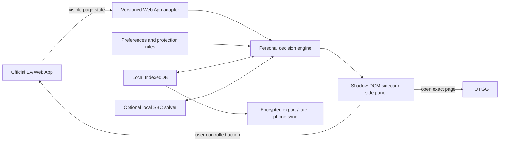

# Personalized FUT Helper: Research and Implementation Framework

Research date: July 29, 2026
Working name: **FUT Co-Pilot**

## Executive recommendation

Build this first as a **local-first Chrome extension that acts as a decision and workflow layer over the official EA Web App**. The first release should help you see, decide, and navigate faster, while keeping every irreversible game action under your direct control.

The best initial product is not a clone of the EA Web App, FUT.GG, or FC Enhancer:

- EA remains the place where authenticated club actions happen.
- FUT.GG remains the external research destination for prices, players, Evolutions, SBCs, and current content.
- Your helper supplies the missing layer: your preferences, your protected players, your workflow, and concise recommendations in the context where you need them.

Start with desktop Chrome. Add an iPhone companion dashboard later, and only build a Safari extension if direct in-browser assistance on iPhone is important enough to justify the extra packaging and maintenance.

Most importantly, deliberately exclude unattended transactions. EA explicitly prohibits bots, automation, and auto-buyers, says players should access FC through official apps, and warns that third-party extensions can expose account information. A read-only or assistive extension is still unofficial, so it is not risk-free; transaction automation is much higher risk and should be outside this project’s design boundary. [EA’s FC rules](https://help.ea.com/en/articles/ea-sports-fc/fc-rules/)

## What the current products do

### 1. EA SPORTS FC 26 Web App

The Web App is the official authenticated operations surface. EA describes it as a browser application for managing Ultimate Team away from the console. It supports club and squad management, the Transfer Market, SBCs, the Store, objectives, rewards, and tactics. [EA Web and Companion App guide](https://help.ea.com/en/articles/ea-sports-fc/early-web-and-companion-app-start/) and [official Web App page](https://www.ea.com/ea-sports-fc/ultimate-team/web-app/)

Its strengths:

- It is the authoritative source for the user’s club and the only appropriate place for game-changing actions.
- It supports nearly the whole menu-management loop without launching the game.
- Its page already contains the context an extension needs: selected item, current screen, visible club items, SBC requirements, transfer listings, and transaction results.

Its weaknesses for this project:

- It is designed for every player rather than one player’s preferred workflow.
- Research context such as prices, trends, player quality, and Evo potential is fragmented across other sites.
- Repetitive menu steps, duplicate handling, SBC protection, and market calculations create friction.
- Its UI is a compiled single-page application. Direct inspection on July 29 showed large versioned bundles and screen classes such as `UTSBCHubView`, `UTTransfersHubView`, and `UTRootView`. An extension coupled directly to those internal names would be fragile.

Implementation consequence: interact through a small, versioned adapter that observes stable visible UI states. Do not spread EA-specific selectors or internal object access throughout the codebase.

### 2. FUT.GG

FUT.GG is primarily an intelligence and planning product. Its current offering includes:

- Player database and extensive filters
- Live prices, price momentum, and historical trends
- GG Rating and position/meta comparisons
- Evo database and Evo Lab
- Squad and tactics builder
- SBC lists, costs, and generated solutions
- Objectives and daily content feed
- Watchlists and Past & Present club views

Sources: [FUT.GG About](https://www.fut.gg/about/), [mobile app overview](https://www.fut.gg/app/), [players](https://www.fut.gg/players/), [Evolutions](https://www.fut.gg/evolutions/), and [SBCs](https://www.fut.gg/sbc/).

The most important recent development is **GG Club**. FUT.GG can now use EA’s official connection system to sync squads, Evolutions, players, tactics, and stats without receiving the player’s EA password. [GG Club](https://www.fut.gg/gg-club/)

EA currently lists FUTBIN, FUT.GG, and FUTWIZ as the three approved partners. Credentials stay with EA and the player chooses whether to grant access. Approved sites can retrieve account data such as players, formations, and tactics, and may retain a pulled account-specific snapshot for up to 28 days. [EA’s Community API announcement](https://www.ea.com/games/ea-sports-fc/fc-26/news/pitch-notes-fc26-community-api-update) and [EA Community API help](https://help.ea.com/en/articles/ea-sports-fc/community-api/)

Constraint for our project: EA is not currently taking applications for new Community API partners, and the API is not a public developer API. We should not pretend to be an approved partner or reproduce its login flow.

FUT.GG’s terms also prohibit automated scraping, copying, reverse engineering, and framing except where expressly permitted. Therefore, the helper should initially use **user-initiated deep links to FUT.GG**, not a private or reverse-engineered FUT.GG endpoint. A formal API or data license can be considered only if FUT.GG offers one or gives permission. [Stormstrike terms](https://stormstrike.gg/terms)

### 3. FC Enhancer

FC Enhancer is the closest existing product to the proposed interaction model: it runs inside or alongside the Web App and reduces repetitive work.

Its current Chrome listing advertises:

- Real-time prices
- Keyboard shortcuts
- SBC solutions based on club players
- Whole-set and daily SBC solving
- Repeatable SBC solving
- Evolution suggestions
- Club analytics

The listing reported 200,000 users, a 4.8 rating, and version 26.1.5.9 updated July 23, 2026. [Chrome Web Store listing](https://chromewebstore.google.com/detail/fc26-enhancer-sbc-solver/boffdonfioidojlcpmfnkngipappmcoh)

Its paid plans add a chemistry optimizer and expand SBC solving across the desktop extension and mobile apps. [FUTNext plans](https://www.futnext.com/subscription) and [feature overview](https://www.futnext.com/install)

Its Firefox listing reveals the practical permission shape of this kind of tool: notifications, access to `www.ea.com`, and optional access to FUTBIN/FUTNext-related hosts. [Firefox listing](https://addons.mozilla.org/en-US/firefox/addon/fc_enhancer/)

The iPhone app advertises inline prices, bargains, and club/player information. Version notes show pack-opening, solver, price-trend, chemistry, Evo-builder, and player-pick work. [Apple App Store](https://apps.apple.com/us/app/fc-enhancer/id1590505179)

Observed weaknesses worth avoiding:

- Subscription prompts and features the user does not need
- Reliability regressions when EA changes its Web App
- Login and UI problems reported in mobile reviews
- Risky market or bulk-action features mixed into otherwise useful quality-of-life features
- Broad access to sensitive authenticated pages
- Different app-store privacy disclosures: Apple reports no collected data, while the Google Play listing describes collection or sharing of some personal, activity, and browsing data. This does not prove misuse, but it makes a transparent local-first design preferable. [Google Play listing](https://play.google.com/store/apps/details?id=com.fut.market.alert)

## The opportunity

The useful gap is a **personal decision engine**, not a generic all-in-one database.

Recent community requests reinforce this. Players want their entire club ranked by Evo opportunity rather than opening each player individually, want imported Evolutions to reflect what is actually available, and want faster “what should I do with this card?” answers. [Club-wide Evo request](https://www.reddit.com/r/fut/comments/1u4mlxd/is_there_a_better_website_than_futgg_for_finding/) and [Community API discussion](https://www.reddit.com/r/EASportsFC/comments/1v80ldd/club_import_is_back_futgg_and_futwiz_partnered/)

The proposed product should answer five questions:

1. **What should I do now?**
2. **Is this card useful to me?**
3. **Should I keep, sell, use, or protect this item?**
4. **What is the cheapest acceptable way to finish this SBC using my rules?**
5. **What squad or Evo change produces the most improvement for my coins and play style?**

## Proposed product modules

### A. Focus Mode

Personalize the EA Web App without changing game behavior:

- Hide or collapse home tiles and sections you never use.
- Add a compact navigation rail for your top destinations.
- Add configurable keyboard shortcuts.
- Preserve the exact filters you repeatedly use.
- Offer density, font-size, contrast, and card-detail settings.

Each shortcut should represent one user action. Avoid macros that loop or transact.

### B. Player Sidecar

When a player card is selected, show a compact panel with:

- Personal status: starter, bench, Evo project, favorite, fodder, trade pile, watchlist
- “Never submit” protection
- Tradeable/untradeable and duplicate status when visible
- User-entered purchase price and configurable net-sale/break-even calculation
- A role-specific personal score
- Direct links to the exact FUT.GG player or search page
- Notes such as “feels better than stats,” preferred chemistry style, or replacement target

The sidecar should explain why it recommends an action. This makes the project educational and lets you tune it instead of trusting a black box.

### C. Duplicate and SBC Guard

This should be the first high-value workflow feature:

- Detect the selected or visible duplicate state.
- Rank useful destinations: active squad, transfer list, SBC storage, a target SBC, or deliberate discard.
- Prefer duplicates and unwanted untradeables.
- Warn before a protected, active-squad, favorite, expensive, or Evo-eligible player is added to an SBC.
- Show a review screen with every item’s personal opportunity cost.
- Require the user to press EA’s final submit/exchange button.

### D. Personal SBC Planner

Model an SBC as hard constraints plus a personal-cost objective.

Hard constraints:

- Squad rating
- Chemistry
- League, nation, club, rarity, position, and item-count requirements
- Special-item or minimum-quality requirements

Personal-cost objective:

- Market or replacement value when known
- Tradeable versus untradeable
- Duplicate and SBC-storage bonuses
- Active-squad, favorite, Evo, and investment penalties
- Avoidable rating overshoot
- User-specific rarity or sentimental protection

A simplified idea is:

`effective burn cost = coin value + protection penalties - duplicate/fodder bonuses`

The solver should return two or three labeled choices, such as:

- Lowest coin-equivalent cost
- Safest for the active club
- Maximum duplicate cleanup

The user reviews a proposed squad and manually submits it.

Google OR-Tools CP-SAT is a suitable educational solver because SBC construction is an integer constraint problem with a clear objective and hard constraints. [OR-Tools CP-SAT](https://developers.google.com/optimization/cp/cp_solver)

### E. Club Brain

Once an authorized or user-controlled inventory snapshot exists:

- Rank all players by eligible Evo improvement.
- Show “best upgrade per slot” under a coin budget.
- Detect redundant cards and weak depth by role.
- Compare candidates using position-specific weights, playstyles, body type, weak foot, skill moves, chemistry fit, and the user’s own feedback.
- Track completed and planned Evolutions.
- Separate objective value from sentimental value.

This is where the project becomes genuinely personal. A high-rated meta card can rank below a favorite club player if that is how the user actually enjoys the game.

### F. Market Notebook

Keep this analytical and user-driven:

- Manual or visible-confirmation-based buy/sell journal
- Configurable market-tax and break-even calculator
- Watchlist with target buy and sell prices
- Realized and unrealized P/L
- “Why I bought this” notes
- Deep link to the Web App’s normal search flow and to FUT.GG research

Do not implement auto-buy, auto-bid, auto-snipe, automatic relisting, market scanning through the user’s EA session, or loops intended to avoid rate limits.

### G. Today View

A personalized start screen:

- Items needing a decision
- Protected-player warnings
- Target SBC progress and expiry
- Available Evo opportunities
- Watchlist targets
- Transfer-list follow-ups
- User-defined daily checklist

Content copied automatically from FUT.GG should wait for authorized access. In the MVP, the Today view can use personal tasks, saved deadlines, and user-opened links to FUT.GG’s current SBC, Evo, and content pages.

## Risk and policy boundary

No third-party EA extension is officially guaranteed safe. Use these as relative risk tiers:

| Tier | Examples | Project decision |
|---|---|---|
| Lowest | Separate local dashboard, manual data entry/import, calculators, notes, FUT.GG deep links | Build freely |
| Lower but unofficial | Read visible Web App state, inject personal UI, one-key/one-action navigation, local warnings | MVP, with minimal permissions and clear disclosure |
| High/unsupported | Programmatically enumerate the club, intercept private API responses, fill actions across many screens, write to EA services | Do not make this the default; require a fresh policy review |
| Prohibited/high account risk | Auto-buy, auto-bid, auto-snipe, automated transactions, CAPTCHA bypass, credential/session-token collection, submit/relist loops, soft-ban avoidance | Explicitly out of scope |

The rule for the product should be: **recommend, prepare, and warn; never impersonate the player or run unattended.**

## Technical framework



### Repository shape

```text
fut-copilot/
  apps/
    chrome-extension/
    dashboard/
    safari-wrapper/          # later
  packages/
    domain/                  # players, inventory, rules, events
    ea-web-adapter/          # the only EA-UI-specific package
    recommendation-engine/
    sbc-model/
    ui/
  services/
    local-solver/            # optional FastAPI + OR-Tools
  fixtures/
    sanitized-webapp-states/
  docs/
    product-decisions/
    risk-boundary.md
```

### Recommended stack

- TypeScript for shared domain logic
- React for the extension side panel and dashboard
- Chrome Manifest V3
- A content script that mounts UI inside a Shadow DOM
- A small service worker for extension lifecycle and explicitly allowlisted requests
- IndexedDB, preferably behind a typed wrapper, for all local player, note, rule, and event data
- Zod or another runtime schema validator at every data-source boundary
- Vitest for domain logic
- Playwright against sanitized fixtures, not the live EA account, for adapter smoke tests
- Python + FastAPI + OR-Tools CP-SAT for the optional localhost solver

Chrome’s current extension model uses Manifest V3 service workers and forbids remotely hosted executable code. Host permissions should be as narrow as possible. Cross-origin requests should be made by the extension service worker only to explicit allowlisted destinations, never to a URL supplied by the page. [Manifest V3](https://developer.chrome.com/docs/extensions/develop/migrate/what-is-mv3), [permissions](https://developer.chrome.com/docs/extensions/mv3/declare_permissions), and [cross-origin request security](https://developer.chrome.com/docs/extensions/develop/concepts/network-requests)

### Adapter design

Define a narrow interface such as:

```ts
interface WebAppAdapter {
  getRoute(): AppRoute;
  getSelectedItem(): VisibleItem | null;
  getVisibleItems(): VisibleItem[];
  getSbcRequirements(): SbcRequirement[] | null;
  getVisibleTransaction(): TransactionObservation | null;
  subscribe(listener: (event: WebAppEvent) => void): () => void;
}
```

Guidelines:

- Prefer semantics and visible labels over minified class names.
- Keep selectors and UI-state inference in one package.
- Use a `MutationObserver` sparingly and debounce rescans.
- Store no EA password, cookie, access token, or session header.
- Sanitize all text before rendering.
- Add a kill switch that disables EA-page integration when the adapter is out of date.
- Test against multiple saved screen states: club, SBC, duplicates, transfer search, listing, and pack results.

### Data model

Core entities:

- `PlayerDefinition`: stable player/card identity and public attributes
- `OwnedItem`: the user’s specific copy, tradeability, purchase price, location, and tags
- `PersonalRule`: protection and preference conditions
- `SbcDefinition`: constraints, rewards, expiry, and completion status
- `Recommendation`: proposed action plus explanation and confidence
- `MarketJournalEntry`: buy/list/sell observation and user notes
- `UiPreference`: hidden sections, shortcuts, and layout
- `ObservedEvent`: local audit trail such as `itemViewed`, `duplicateSeen`, `itemProtected`, `proposalAccepted`

Keep public card definitions separate from personally owned items. This prevents a common design error where an evolved or untradeable copy is confused with the generic market card.

### iPhone path

Use two stages:

1. A responsive read-only dashboard or installable PWA for lists, plans, alerts, and recommendations.
2. If direct Web App enhancement is essential, package the shared extension as a Safari Web Extension in Xcode.

Apple supports Safari Web Extensions on iOS 15 and later and uses the same general JavaScript/HTML/CSS extension model as other browsers, but the extension must be packaged inside an iOS app for distribution. [Apple Safari Web Extensions](https://developer.apple.com/documentation/safariservices/safari-web-extensions) and [creating an extension](https://developer.apple.com/documentation/safariservices/creating-a-safari-web-extension)

## Data-source policy

Use:

- Data the user explicitly enters
- Data visible on the current official EA Web App screen
- Sanitized local exports the user explicitly creates
- EA’s public launch ratings database for base-card educational data [EA FC 26 ratings](https://www.ea.com/games/ea-sports-fc/ratings)
- Official or expressly licensed APIs if they become available
- User-initiated deep links to FUT.GG pages

Do not use:

- The user’s EA credentials or session tokens
- A counterfeit EA login flow
- Reverse-engineered FC Community API calls
- Automated FUT.GG scraping
- Undocumented price endpoints without permission
- A cloud service that receives the authenticated EA session

## Phased roadmap

### Phase 0 — Workflow discovery

Record 5–10 normal sessions and write down:

- The screen and starting state
- The goal
- Repeated clicks/keystrokes
- Information looked up elsewhere
- Mistakes or risky moments
- Desired outcome and time spent

Select the top two workflows by frequency × frustration × feasibility.

### Phase 1 — Read-only Chrome MVP

Deliver:

- Extension shell and versioned adapter
- Focus Mode
- Player Sidecar
- Local tags and protected-player rules
- FUT.GG deep links
- Break-even calculator
- One-key/one-action navigation shortcuts
- Local import/export

Success tests:

- No EA credentials or tokens are stored.
- Removing the extension leaves the EA page unaffected.
- An EA UI change disables only the broken adapter feature.
- Every recommendation shows its reason.

### Phase 2 — Duplicate and SBC Co-Pilot

Deliver:

- Duplicate triage
- SBC requirements parser
- Local inventory import/capture strategy chosen after the policy review
- Personal burn-cost model
- Solver returning reviewable alternatives
- Protected-item and overspend warnings

Keep final submission manual.

### Phase 3 — Club Brain

Deliver:

- Whole-club player board
- Evo opportunity ranking
- Squad weak-link analysis
- Budgeted upgrade suggestions
- Personal scoring based on position, formation, play style, and favorites
- Today view

### Phase 4 — Mobile

Deliver the responsive dashboard first. Add Safari extension functionality only for the specific workflows that truly need it.

### Phase 5 — Annual-game hardening

- Separate FC 26 and FC 27 definitions
- Version all adapters and data schemas
- Add a release-day compatibility checklist
- Keep personalized rules and history portable across game cycles

## Decisions needed from you

Please answer these before implementation:

1. **Primary device:** Is the first version for desktop Chrome, or must iPhone work from day one?
2. **Top workflows:** Which three consume the most time today—SBC grinding, duplicate handling, transfer research, buying, selling/listing, Evolutions, squad upgrades, objectives, or something else?
3. **Current tools:** Which FC Enhancer features do you use every session, and which ones do you want removed?
4. **Action boundary:** Are you comfortable with the recommended assistive model—read visible state, calculate, guide, warn, and leave game actions to you—or were you expecting unattended automation?
5. **Club/data access:** Do you have a FUT.GG account with GG Club connected? Which platform and market do you use: PlayStation, Xbox, or PC?
6. **Personal rules:** Which players or categories should never be submitted or sold? Do you prioritize meta performance, favorite clubs/players, first-owner cards, Evolutions, trading profit, or a mixture?
7. **Coding level:** What have you built before, and would you rather learn TypeScript/React, Python, or both through this project?
8. **Privacy/sync:** Should everything stay on one computer, or do you want encrypted sync between Chrome and iPhone later?
9. **Examples:** Can you describe one recent SBC session and one transfer-market session that felt unnecessarily slow or frustrating?

## First build recommendation

After the answers, the best first vertical slice is likely:

> Select a visible player in the EA Web App → open the personal sidecar → see protection, personal tags, break-even math, and a FUT.GG link → receive a keep/sell/SBC recommendation with an explanation → take the action manually.

That slice proves the extension adapter, local database, rule engine, UI, and account-safety boundary without beginning with the hardest or riskiest feature. The same foundation then supports duplicate triage and the SBC planner.
